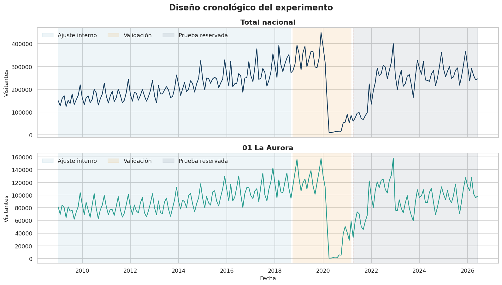
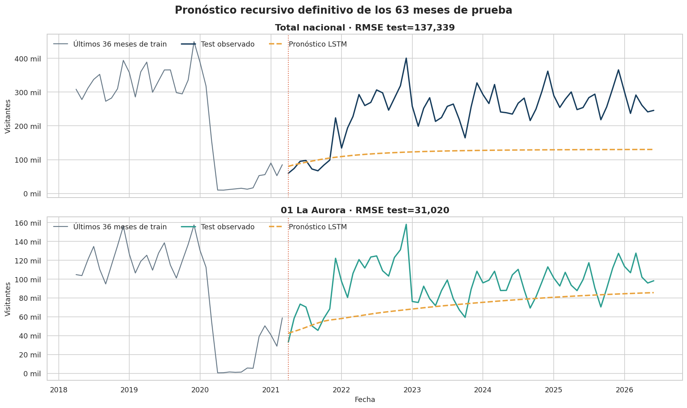
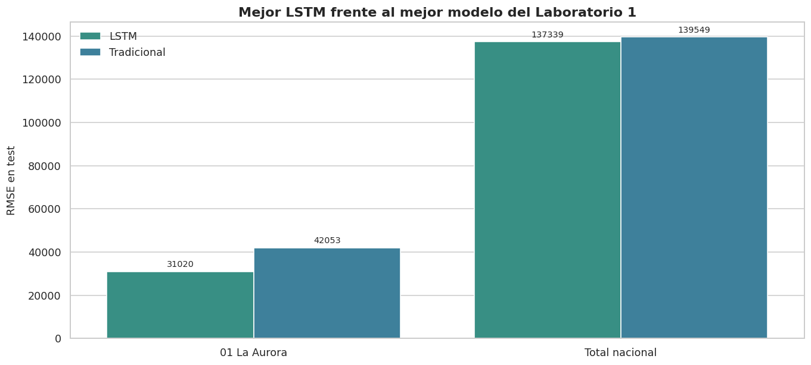
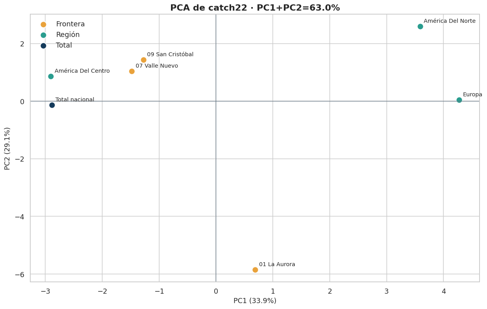
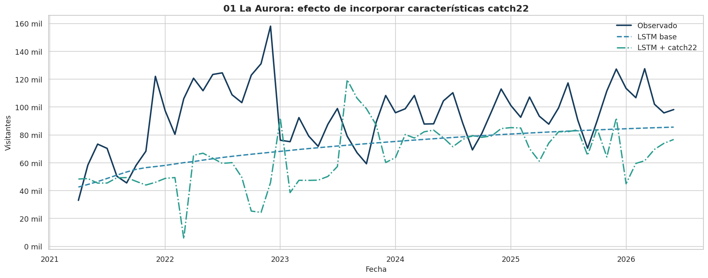

# Laboratorio 2: Series de Tiempo con LSTM


Análisis y pronóstico de series temporales de visitantes internacionales en
Guatemala mediante modelos **LSTM**, comparación con métodos tradicionales y
exploración de similitud utilizando **catch22**.

Esta es la versión final y reproducible del Laboratorio 2. Incluye el notebook
completo y ejecutado, la base de datos, las 13 figuras actuales, un informe
técnico, un informe divulgativo para público no especializado y los PDF
compilados de ambos documentos.

> **Repositorio oficial:**  
> [DanielBarillasM/Lab-2_Series-de-Tiempo-con-LSTM_DC_Grupo-1](https://github.com/DanielBarillasM/Lab-2_Series-de-Tiempo-con-LSTM_DC_Grupo-1)

### Accesos principales

| Entregable | Archivo |
|---|---|
| Notebook final | [`Laboratorio_2_Deep_Learning_COMPLETO.ipynb`](Lab02/Versión-Final/Laboratorio_2_Deep_Learning_COMPLETO.ipynb) |
| Informe técnico | [`Informe_Tecnico_Laboratorio_2_Deep_Learning.pdf`](Lab02/Versión-Final/Informe/Informe_Tecnico_Laboratorio_2_Deep_Learning.pdf) |
| Informe divulgativo | [`Informe_Divulgativo_Laboratorio_2.pdf`](Lab02/Versión-Final/Informe/Informe_Divulgativo_Laboratorio_2.pdf) |
| Dependencias | [`requirements.txt`](requirements.txt) |

---

## Información académica

| Campo | Información |
|---|---|
| Universidad | Universidad del Valle de Guatemala |
| Facultad | Facultad de Ingeniería |
| Departamento | Departamento de Ciencias de la Computación |
| Curso | CC3084 - Data Science |
| Sección | 11 |
| Docente | García Pérez, Lynette |
| Actividad | Laboratorio 2 - Deep Learning para Series de Tiempo |
| Período analizado | Enero de 2009 a junio de 2026 |
| Fecha de entrega | 2 de agosto de 2026 |

### Integrantes

- Jorge Gabriel Palacios Sales
- Pablo Daniel Barillas Moreno
- Roberto Emiliano Otoniel Camposeco Torres

---

## Objetivo del laboratorio

El laboratorio estudia el comportamiento mensual de los visitantes
internacionales que ingresan a Guatemala y evalúa si una red neuronal de tipo
**Long Short-Term Memory (LSTM)** puede producir pronósticos competitivos.

La versión final desarrolla los siguientes componentes:

1. Preparación y validación de la base de migración.
2. Reconstrucción de series temporales mensuales.
3. Selección de dos series principales para el modelado.
4. Construcción y tuneo de varias configuraciones LSTM.
5. Evaluación cronológica en validación y prueba.
6. Comparación contra los mejores modelos tradicionales del Laboratorio 1.
7. Extracción de 22 características temporales con catch22.
8. Análisis de similitud mediante PCA, distancias y agrupamiento jerárquico.
9. Evaluación experimental de una LSTM enriquecida con características
   catch22.
10. Generación de 13 figuras actualizadas directamente desde las salidas del
    notebook final.
11. Elaboración de un informe técnico y un informe divulgativo, ambos
    alineados con las métricas, figuras y conclusiones del notebook.

---

## Cumplimiento de la actividad

La actividad solicitaba, como mínimo:

- al menos dos modelos LSTM con tuneo de parámetros;
- predicciones para las series seleccionadas;
- comparación con modelos tradicionales;
- exploración de similitud mediante el algoritmo catch22.

La versión final cumple estos puntos mediante cuatro configuraciones
principales por cada serie:

| Configuración | Ventana temporal | Unidades LSTM | Capas | Tasa de aprendizaje |
|---|---:|---:|---:|---:|
| LSTM-1A | 12 meses | 8 | 1 | 0.010 |
| LSTM-1B | 24 meses | 16 | 1 | 0.006 |
| LSTM-2A | 12 meses | 12 y 6 | 2 | 0.006 |
| LSTM-2B | 24 meses | 16 y 8 | 2 | 0.004 |

Las configuraciones fueron comparadas con un conjunto de validación separado.
Después se reentrenó la mejor alternativa de cada serie y se evaluó una sola
vez en el conjunto final de prueba.

También se documentaron dos diseños adicionales, `LSTM-1X` y `LSTM-2X`, que
fueron probados en ambas series y luego descartados. Su inclusión permite
explicar por qué una red más grande o una ventana más larga no garantizan una
mejor capacidad de generalización.

---

## Datos utilizados

El archivo `Base_Migracion_2009-2026jun.xlsx` contiene los registros utilizados
para reconstruir las series mensuales.

### Resumen de la base

- **161,036 registros** en la tabla original.
- **210 meses consecutivos**.
- Período comprendido entre **enero de 2009 y junio de 2026**.
- No se detectaron meses faltantes en las series modeladas.
- No se utilizaron observaciones futuras para entrenar modelos del pasado.

### Series principales

1. **Total nacional:** suma mensual de visitantes internacionales.
2. **Frontera 01 La Aurora:** ingresos mensuales registrados por esa vía.

La separación de los datos conserva el orden temporal y es la misma del Laboratorio 1
(147 meses de entrenamiento y 63 de prueba):

- entrenamiento: enero de 2009 a marzo de 2021 (147 meses), que a su vez se divide en
  - ajuste interno: enero de 2009 a septiembre de 2018 (117 meses),
  - validación: octubre de 2018 a marzo de 2021 (30 meses);
- prueba: abril de 2021 a junio de 2026 (63 meses).

La validación interna se usa solo para escoger hiperparámetros. El conjunto de prueba se
evalúa una única vez, al final.



---

## Metodología

### 1. Preprocesamiento

La fecha fue construida a partir del año y el mes de cada registro. Después se
agruparon los datos por mes, se verificó la continuidad temporal y se escalaron
los valores usando únicamente la información disponible en el entrenamiento.

### 2. Ventanas temporales

Para que la LSTM pueda aprender del pasado, cada observación se convierte en
una secuencia de meses anteriores:

- ventana de 12 meses para capturar un ciclo anual;
- ventana de 24 meses para aportar dos años de contexto.

### 3. Modelos LSTM

La implementación de la LSTM fue desarrollada con **NumPy**, por lo que el
notebook permite observar directamente la lógica de las compuertas, el proceso
de entrenamiento y la actualización de parámetros.

El tuneo considera:

- tamaño de la ventana;
- cantidad de capas;
- número de unidades ocultas;
- tasa de aprendizaje;
- número máximo de épocas;
- paciencia para detener el entrenamiento cuando la validación deja de
  mejorar.

### 4. Métricas

El desempeño se evalúa con:

- **MAE:** error absoluto promedio.
- **RMSE:** penaliza con mayor intensidad los errores grandes.
- **NRMSE:** expresa el RMSE en relación con el promedio de la serie.
- **sMAPE:** error porcentual simétrico.

Una métrica más pequeña representa un pronóstico más cercano a los valores
observados.

---

## Resultados principales

### Desempeño final de las LSTM

| Serie | Modelo ganador | MAE | RMSE | NRMSE | sMAPE |
|---|---|---:|---:|---:|---:|
| Total nacional | LSTM-1A | 123,954 | 137,339 | 56.84 % | 63.35 % |
| 01 La Aurora | LSTM-2A | 24,473 | 31,020 | 32.97 % | 28.15 % |



### Comparación con modelos tradicionales

| Serie | LSTM | RMSE LSTM | Modelo tradicional | RMSE tradicional | Mejora |
|---|---|---:|---|---:|---:|
| Total nacional | LSTM-1A | 137,339 | Prophet | 139,549 | 1.58 % |
| 01 La Aurora | LSTM-2A | 31,020 | Suavizamiento exponencial simple | 42,053 | 26.24 % |

La LSTM presentó una mejora pequeña para el total nacional y una reducción
considerable del error para La Aurora.



> Los resultados deben interpretarse como un ejercicio académico. La
> interrupción extraordinaria ocurrida desde 2020 produjo un cambio estructural
> que aumenta la dificultad del pronóstico.

---

## Análisis de similitud con catch22

`catch22` resume cada serie mediante 22 características que describen aspectos
como autocorrelación, periodicidad, variabilidad, comportamiento de valores
extremos y cambios sucesivos.

Se analizaron siete series:

- total nacional;
- América del Centro;
- América del Norte;
- Europa;
- La Aurora;
- Valle Nuevo;
- San Cristóbal.

### Hallazgos

- La matriz obtenida tiene **7 series y 22 características**.
- Los dos primeros componentes del PCA explican **63.04 %** de la variación.
- El par más parecido fue **total nacional y América del Centro**, con una
  distancia estandarizada de **2.667**.
- **La Aurora** fue la serie más atípica, con una distancia al centroide de
  **6.053**.
- El agrupamiento jerárquico produjo tres grupos:
  1. total nacional, América del Centro, Valle Nuevo y San Cristóbal;
  2. América del Norte y Europa;
  3. La Aurora.



### LSTM enriquecida con catch22

También se evaluó si agregar las características catch22 de la ventana de
entrada mejoraba el modelo de La Aurora.

| Modelo | MAE | RMSE | sMAPE |
|---|---:|---:|---:|
| LSTM-2A base | 24,473 | 31,020 | 28.15 % |
| LSTM-2A + catch22 | 34,356 | 42,907 | 43.58 % |
| Suavizamiento exponencial simple | 36,822 | 42,053 | 45.47 % |

El modelo enriquecido no superó a la LSTM base. Esto muestra que añadir más
variables no garantiza una mejor predicción; las características adicionales
deben aportar información complementaria y estable.



---

## Informes y figuras finales

El repositorio contiene dos versiones del informe:

- **Informe técnico:** documenta la preparación de datos, implementación de la
  LSTM, tuneo, métricas, candidatos descartados, comparación con el Laboratorio
  1, análisis catch22 y modelo enriquecido.
- **Informe divulgativo:** resume los mismos resultados en lenguaje sencillo
  para lectores sin experiencia en programación o estadística.

Ambos informes utilizan las figuras exportadas desde la ejecución final del
notebook. La carpeta `figuras/` contiene 13 archivos PNG actualizados y no debe
separarse de los archivos `.tex`.

---

## Estructura actual del repositorio

```text
.
├── Lab02/
│   ├── avances/
│   │   ├── Base_Migracion_2009-2026jun.xlsx
│   │   └── Laboratorio_2_Deep_Learning_Avance_LSTM.ipynb
│   │
│   ├── Repositorio/
│   │   ├── Portada_Entrega_Laboratorio_2.docx
│   │   └── Portada_Entrega_repo_Laboratorio_2.pdf
│   │
│   └── Versión-Final/
│       ├── Base_Migracion_2009-2026jun.xlsx
│       ├── Laboratorio_2_Deep_Learning_COMPLETO.ipynb
│       └── Informe/
│           ├── Informe_Divulgativo_Laboratorio_2.pdf
│           ├── Informe_Divulgativo_Laboratorio_2.tex
│           ├── Informe_Tecnico_Laboratorio_2_Deep_Learning.pdf
│           ├── Informe_Tecnico_Laboratorio_2_Deep_Learning.tex
│           └── figuras/
│               ├── catch22_correlaciones.png
│               ├── catch22_dendrograma.png
│               ├── catch22_distancias.png
│               ├── catch22_heatmap.png
│               ├── catch22_pca.png
│               ├── comparacion_configuraciones.png
│               ├── comparacion_lab1.png
│               ├── curvas_aprendizaje.png
│               ├── lstm_catch22.png
│               ├── particion_cronologica.png
│               ├── pronostico_test.png
│               ├── series_seleccionadas.png
│               └── validacion_predicciones.png
├── README.md
└── requirements.txt
```

### Descripción de carpetas

| Carpeta | Contenido |
|---|---|
| `Lab02/avances/` | Entrega realizada durante el período de clase: base y notebook del avance. |
| `Lab02/Repositorio/` | Portada utilizada para presentar el enlace del repositorio. |
| `Lab02/Versión-Final/` | Base y notebook completo, ejecutado y documentado. |
| `Lab02/Versión-Final/Informe/` | Fuentes LaTeX y PDF compilados de los informes técnico y divulgativo. |
| `Lab02/Versión-Final/Informe/figuras/` | Las 13 gráficas actualizadas y exportadas desde el notebook final. |
| `requirements.txt` | Dependencias necesarias para reproducir la ejecución. |

---

## Cómo ejecutar el notebook

### 1. Clonar el repositorio

```bash
git clone https://github.com/DanielBarillasM/Lab-2_Series-de-Tiempo-con-LSTM_DC_Grupo-1.git
cd Lab-2_Series-de-Tiempo-con-LSTM_DC_Grupo-1
```

### 2. Crear un entorno virtual

#### Windows

```powershell
python -m venv .venv
.\.venv\Scripts\activate
```

#### Linux o macOS

```bash
python3 -m venv .venv
source .venv/bin/activate
```

### 3. Instalar dependencias

```bash
python -m pip install --upgrade pip
python -m pip install -r requirements.txt
```

El archivo `requirements.txt` contiene exactamente:

```text
jupyter
numpy==2.4.4
pandas==3.0.2
matplotlib
seaborn
scipy
scikit-learn
openpyxl
pycatch22==0.4.5
```

Las versiones de NumPy, pandas y pycatch22 se fijaron para que el entorno sea
consistente con la versión final del laboratorio. Las demás bibliotecas se
instalan en una versión compatible disponible para el entorno utilizado.

### 4. Abrir Jupyter Notebook

```bash
jupyter notebook
```

Después debe abrirse:

```text
Lab02/Versión-Final/Laboratorio_2_Deep_Learning_COMPLETO.ipynb
```

Se recomienda ejecutar todas las celdas en orden mediante:

```text
Kernel > Restart & Run All
```

El archivo `Base_Migracion_2009-2026jun.xlsx` debe permanecer dentro de la
carpeta `Lab02/Versión-Final/`.

---

## Compilación de los informes

Los informes utilizan las imágenes almacenadas en la carpeta `figuras/`.
Para conservar las rutas relativas, no se debe separar esa carpeta de los
archivos `.tex`.

```bash
cd "Lab02/Versión-Final/Informe"
pdflatex Informe_Tecnico_Laboratorio_2_Deep_Learning.tex
pdflatex Informe_Tecnico_Laboratorio_2_Deep_Learning.tex

pdflatex Informe_Divulgativo_Laboratorio_2.tex
pdflatex Informe_Divulgativo_Laboratorio_2.tex
```

La doble compilación actualiza correctamente índices, referencias y números de
página. Ambos documentos fueron verificados con **PdfLaTeX**; no requieren
XeLaTeX ni LuaLaTeX.

---

## Tecnologías utilizadas

- Python 3.
- Jupyter Notebook.
- NumPy 2.4.4.
- pandas 3.0.2.
- Matplotlib.
- seaborn.
- SciPy.
- scikit-learn.
- openpyxl.
- pycatch22 0.4.5.
- LaTeX.
- Git y GitHub.

---

## Reproducibilidad

El notebook:

- fija semillas para reducir variaciones entre ejecuciones;
- separa los datos de manera cronológica;
- ajusta los escaladores únicamente con el entrenamiento;
- selecciona hiperparámetros usando validación;
- reserva la prueba para la evaluación definitiva;
- deja visibles las tablas, gráficas y conclusiones;
- documenta las decisiones metodológicas y sus limitaciones.
- conserva las mismas métricas y nombres de figuras utilizados por los dos
  informes.

Los tiempos de ejecución pueden cambiar según el procesador y la memoria
disponible.

---

## Conclusiones

1. Las LSTM lograron resultados competitivos frente a los métodos
   tradicionales.
2. La mejora más importante se obtuvo para La Aurora.
3. El total nacional continúa siendo difícil de pronosticar por la magnitud del
   cambio estructural observado desde 2020.
4. catch22 permitió comparar las series por su comportamiento y no únicamente
   por su categoría administrativa.
5. La Aurora presentó el patrón temporal más diferente dentro del conjunto
   estudiado.
6. Agregar características catch22 directamente a la LSTM no mejoró el
   pronóstico, por lo que la LSTM base se mantiene como la mejor alternativa
   para esa serie.
7. Los informes técnico y divulgativo quedaron sincronizados con el notebook
   final y utilizan las 13 figuras actuales del análisis.

---

## Uso académico

Este repositorio fue preparado con fines académicos para el curso
**CC3084 - Data Science**.